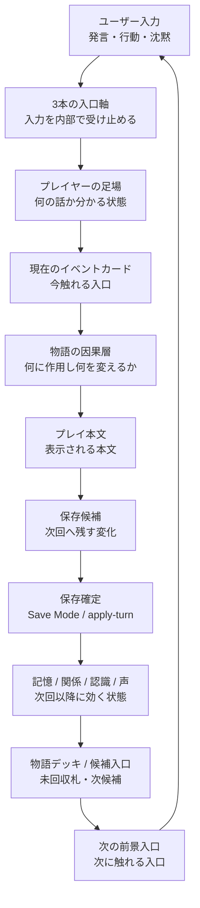
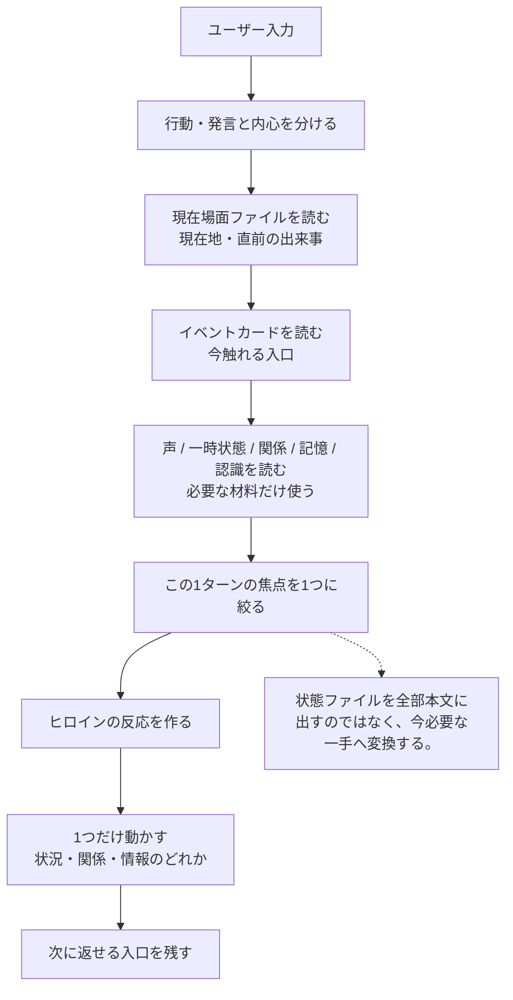
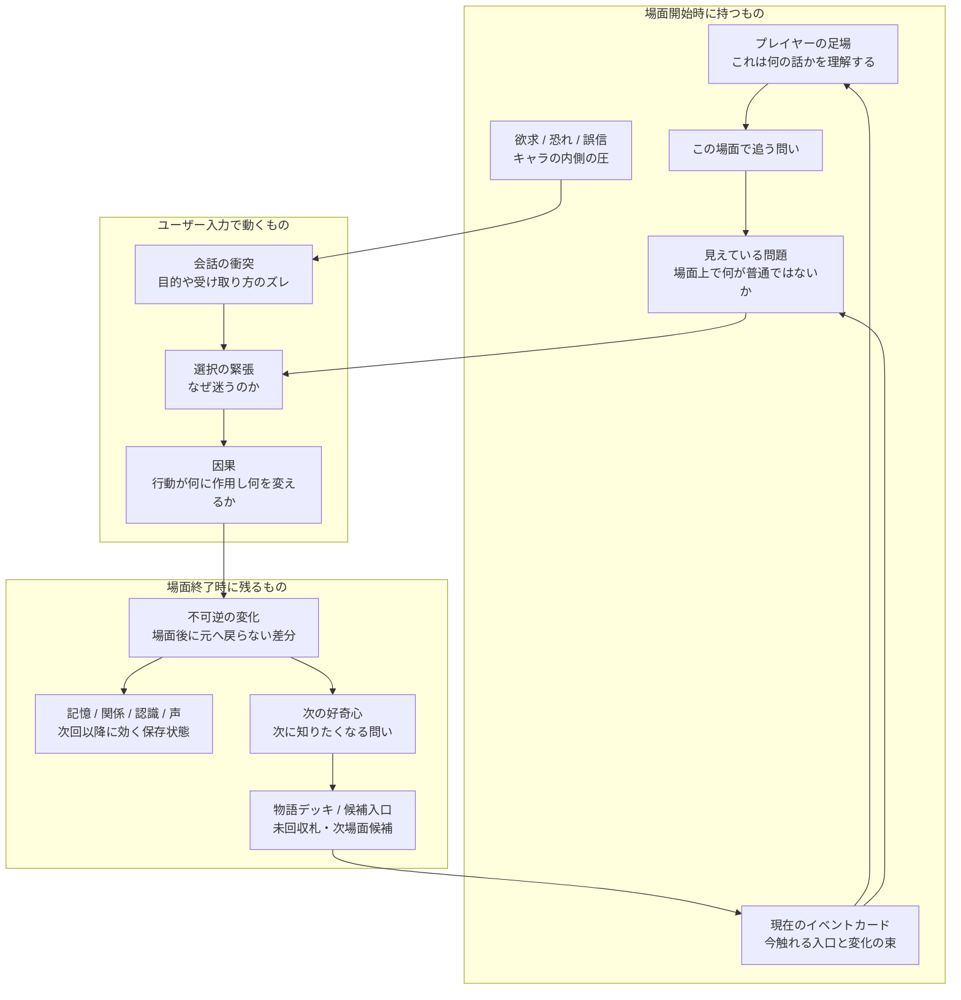
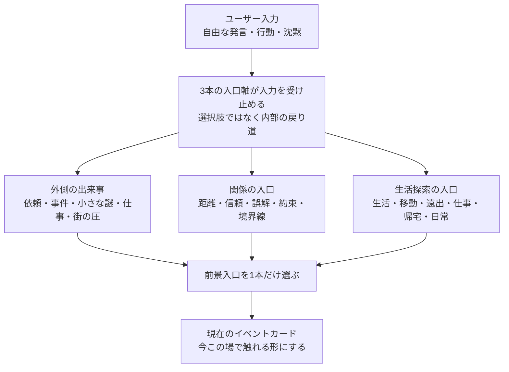
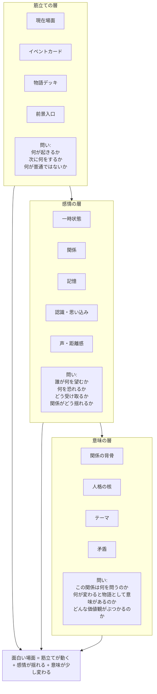
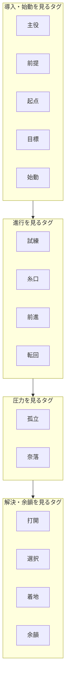
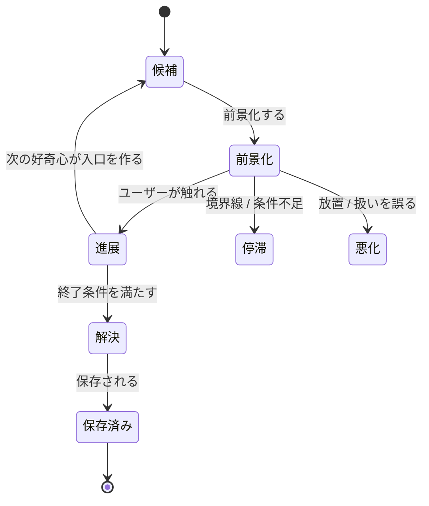
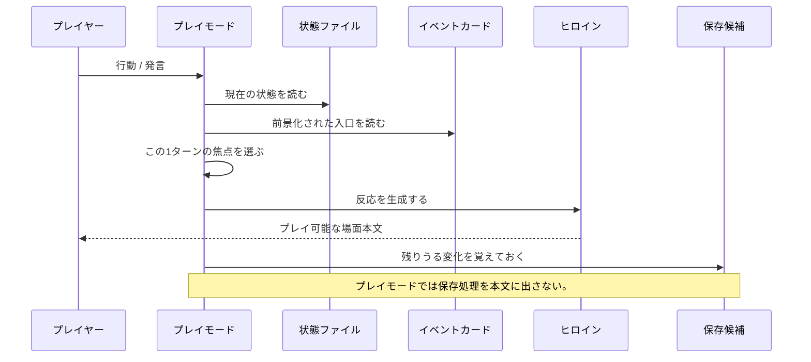

# LILIA 物語エンジン Mermaid マップ

このファイルは、LILIAの物語エンジン構造をMermaidで素早く確認するための可視化メモです。
目的は、仕様を増やすことではなく、「分かりやすさ」と「面白さを生む作用」を図で把握することです。

特定セッションや特定題材には依存しません。

## 1. 全体循環

LILIAの全体循環です。入力は本文出力で終わらず、状態更新と次の入口候補を通って、次の入力へ戻ります。

注記: プレイ本文の中では保存処理を見せない。保存候補は、Save Mode / apply-turn を通って初めて確定保存される。

## 2. 1ターン処理

1ターンの内部処理です。状態ファイルは本文へそのまま出すのではなく、今必要な一手へ変換します。

## 3. 要素関係図

物語要素の関係図です。場面開始時に持つもの、ユーザー入力で動くもの、場面終了時に残るものを分けます。

## 4. 3本の入口軸

3本の入口軸は選択肢UIではありません。自由入力を内部で受け止め、プレイモードではそのうち1本だけが前景入口としてイベントカードに出ます。

## 5. 物語の三層

筋立て・感情・意味の三層です。場面は、何が起きるかだけでなく、何が揺れて何に意味が生まれるかで面白くなります。

## 6. 場面機能の診断タグ

物語を進める15機能です。これは固定プロット順ではなく、場面の役割を診断するためのタグ群です。

各機能の意味:

- 主役: 誰を追う話か
- 前提: どんな暮らし・ルールの上にあるか
- 起点: 何が日常を揺らすか
- 目標: 何を求めて動くか
- 始動: なぜ一歩踏み出すか
- 試練: 何が難しいか
- 糸口: 次へ進む足場
- 前進: 何が少し進んだか
- 転回: 問題の意味がどう変わったか
- 孤立: 何を失い、自分で選ぶか
- 奈落: 関係や心が最も沈む点
- 打開: 積み上げたものが突破口になる
- 選択: 中心問題にどう答えるか
- 着地: 何が決まり、何が変わったか
- 余韻: どんな感情と次の問いが残るか

注記: これは固定プロット順ではなく、場面の役割を診断するための道具。毎回この順番で処理するものではない。

## 7. 状態遷移図

イベントカード / 入口候補の状態遷移です。前景化された入口は、進展、停滞、悪化、解決、保存へ分岐します。

## 8. 1ターンのやり取り

1ターン内のやり取りです。プレイモードは状態を読み、前景化された入口を見て本文を作りますが、保存処理そのものは本文に出しません。

